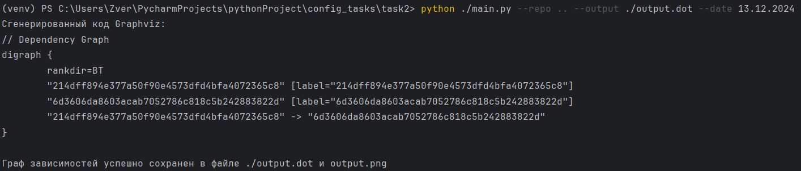
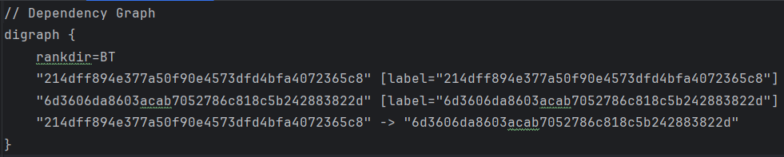
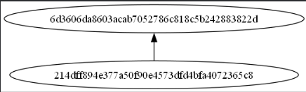

# Визуализатор графа зависимостей коммитов Git

## Описание
Этот проект представляет собой инструмент для анализа и визуализации графа зависимостей коммитов в Git-репозитории. Программа считывает данные из указанного репозитория, строит граф зависимостей между коммитами и отображает его в формате Graphviz. Граф отображает номера коммитов в хронологическом порядке и позволяет учитывать только коммиты, сделанные до определённой даты.

Инструмент поддерживает сохранение результата в виде исходного файла .dot, который можно использовать для дальнейшей работы с Graphviz, а также вывод изображения графа в формате .png для визуального анализа.

## Установка

1. **Клонируйте репозиторий:**
  ```bash
  git clone <URL репозитория>
  cd <директория проекта>>
  ```
2. **Установите зависимости**
  ```bash
  pip install -r requirements.txt
  ```
## Использование
Для запуска основного скрипта используйте следующую команду:
```bash
python main.py --repo <путь_к_репозиторию> --output <путь_к_файлу_для_сохранения> --date <дата_в_формате_dd.mm.yyyy>
```

Это создаст граф зависимостей коммитов до указанной даты и сохранит его в файле `output_graph.dot`, а также сгенерирует изображение `output.png`.

Пример вывода текста в консоль:



Файл output_graph.dot:



Изображение графа output.png:



## Тестирование
Для запуска тестов используйте модуль unittest:
```bash
python -m unittest ../tests/tests2.py
```

Пример тестирования:


